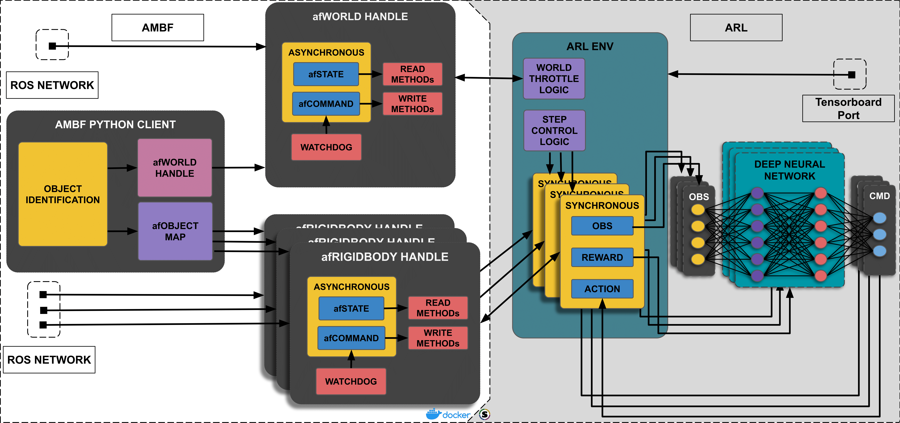

# AMBF Reinforcement Learning (AMBF-RL) Toolkit


The AMBF-RL (ARL) toolkit assists in designing control algorithms for medical 
robots by providing environments conducive to medical settings and accurate 
models of well-known medical robotic platforms. 
It wraps [OpenAI-gym](https://github.com/openai/gym) and 
[stable-baselines](https://github.com/hill-a/stable-baselines) to provide an 
interface to train state of the art RL algorithms for robots in the 
[Asynchronous Multibody Framework (AMBF)](https://github.com/WPI-AIM/ambf) 
simulation environment.

## Architecture



## Requirements  

- Computer with Ubuntu Bionic (18.04) or Ubuntu Bionic Server (18.04)
- [ROS Melodic - 1.14.*](http://wiki.ros.org/melodic/Installation/Ubuntu)
- (Optional) NVIDIA GPU
  - [CUDA - 10.0 (10.0.130)](https://developer.nvidia.com/cuda-10.0-download-archive)
  - [CUDNN - 7.4.2](https://developer.nvidia.com/compute/machine-learning/cudnn/secure/v7.4.2/prod/10.0_20181213/cudnn-10.0-linux-x64-v7.4.2.24.tgz)
- (Optional) Docker

## Install
### 1. Docker method

If docker is installed, the dockerfile [devel-training-gpu](dockerfiles/devel-training-gpu.Dockerfile) can be run.
```bash
cd ~/
git clone https://github.com/WPI-AIM/ambf_rl.git && cd ambf_rl
sudo service docker start
docker build --rm -f "dockerfiles/devel-training-gpu.Dockerfile" -t ambf_rl:devel-training-gpu "."
docker run --rm -it ambf_rl:devel-training-gpu
# Now inside the interactive container
cd ~/ambf_rl
python scripts/dVRK/main.py
```

### 2. Install dependencies

Clone and install ambf requirements
```bash
source /opt/ros/melodic/setup.bash
cd ~/
git clone --branch ambf-1.0-python3-fix \ 
  https://github.com/DhruvKoolRajamani/ambf.git
cd ~/ambf
sudo apt-get -y -qq install --fix-missing \ 
  $(cat install/apt-requirements.txt)
cat install/pip-requirements.txt | xargs -n 1 -L 1 pip install -U
mkdir build && cd build
cmake ../
make -j$(nproc)
```

**Optional:** Install python-venv to use a virtual environment
```bash
sudo apt-get install python3-venv python-venv
```

Now clone this repository and install training requirements
```bash
source ~/ambf/build/devel/setup.bash
cd ~/
git clone https://github.com/WPI-AIM/ambf_rl.git
```

**Optional:** If venv is already installed, create and source the virtual environment.
```bash
cd ~/ambf_rl
virtualenv --python=/usr/bin/python3 pyenv_arl_training
source ~/ambf_rl/pyenv_arl_training/bin/activate
```

Continue with the installation of training specific requirements.
```bash
cd ~/ambf_rl
cat install/training-pip-requirements.txt | xargs -n 1 -L 1 pip3 install -U
```

Copy the ddpg fix to the installed stable-baselines folder.  
If the virtual environment was installed,  
`<path to python site-packages>=~/ambf_rl/pyenv_arl_training/lib/python3.6/site-packages/>` ortherwise  
`<path to python site-packages>=~/.local/lib/python3.6/site-packages/>`
```bash
mv <path to python site-packages>/stable_baselines/ddpg/ddpg.py \
  <path to python site-packages>/stable_baselines/ddpg/ddpg_old.py && \
  cp ${AMBF_RL_WS}/install/stable_baseline_fix/ddpg.py \
  <path to python site-packages>/stable_baselines/ddpg/
```

Example: if venv exists
```bash
mv ~/ambf_rl/pyenv_arl_training/lib/python3.6/site-packages/stable_baselines/ddpg/ddpg.py \
  ~/ambf_rl/pyenv_arl_training/lib/python3.6/site-packages/stable_baselines/ddpg/ddpg_old.py && \
  cp ${AMBF_RL_WS}/install/stable_baseline_fix/ddpg.py \
  ~/ambf_rl/pyenv_arl_training/lib/python3.6/site-packages/stable_baselines/ddpg/
```

Finally install AMBF-RL
```bash
cd ~/ambf_rl
python setup.py install
```

Test the installation by running the example DDPG or HER+DDPG algorithms to train the dVRK PSM to reach a point.
```bash
cd ~/ambf_rl
source /opt/ros/melodic/setup.bash
source ~/ambf/build/devel/setup.bash
# If a virtual environment was created
source ~/ambf_rl/pyenv_arl_training/bin/activate
cd scripts/dVRK/
python main.py
```
An instance of AMBF will spawn and training should begin.

## Developer Guide

If using .vscode as an IDE, it would be helpful to export the path to the AMBF-RL workspace to your .bashrc, or individual terminal session.
```bash
# Individual terminal session
export AMBF_WS=~/ambf
export AMBF_RL_WS=~/ambf_rl

# .bashrc
echo "export AMBF_WS=~/ambf" >> ~/.bashrc
echo "export AMBF_RL_WS=~/ambf_rl" >> ~/.bashrc
source ~/.bashrc
```

### Abstract AMBF-RL Base Class

- [arl_env.py](envs/arl/arl_env.py) is an abstract base class that automatically connects to the `ambf_client` and objects spawned in ambf.
```python
class ARLEnv(gym.Env, metaclass=ABCMeta):
  """Base class for the ARLEnv

  This class should not be instantiated on its own. It does not contain the 
  desired RL Algorithm or the Robot. This should remain an abstract class and
  should be wrapped by at least an algorithmic and robot environment wrapper.
  An example of this can be PSM_cartesian_env_ddpg(ARLEnv).

  Attributes
  ----------
  
  Methods
  -------
  skip_skipped_sim_steps(num)
      Define number of steps to skip if step-throttling is enabled.
  
  set_throttling_enable(check):
      Set the step-throttling Boolean.
  """

  def __init__(
    self,
    enable_step_throttling: bool,
    n_skip_steps: int,
    env_name: str = "arl_env"
  ) -> None:
    """Initialize the abstract class which handles all AMBF related interactions
    
    Parameters
    ----------
    enable_step_throttling : bool
        Flag to enable throttling of the simulator
    n_skip_steps : int
        Number of steps to skip after an update step
    env_name : str
        Name of the environment to train
    """
```

- For dVRK PSM environments that are based in the cartesian space, an abstract class [PSM_cartesian_env.py](envs/dVRK/PSM_cartesian_env.py) has been created and should be inherited.
```python
class PSMCartesianEnv(ARLEnv, metaclass=ABCMeta):
  """Single task based environment for PSM to perform debris removal as shown in
  the paper:

  The environment performs actions in the cartesian space in R3, with translational
  movements in x, y, and z.
  """

  def __init__(
    self,
    action_space_limit: float,
    goal_position_range: float,
    position_error_threshold: float,
    goal_error_margin: float,
    joint_limits: Dict[str,
                       np.ndarray or List[str]],
    workspace_limits: Dict[str,
                           np.ndarray or List[str]],
    enable_step_throttling: bool,
    joints_to_control: List[str] = [
      'baselink-yawlink',
      'yawlink-pitchbacklink',
      'pitchendlink-maininsertionlink',
      'maininsertionlink-toolrolllink',
      'toolrolllink-toolpitchlink',
      'toolpitchlink-toolgripper1link',
      'toolpitchlink-toolgripper2link'
    ],
    steps_to_print: int = 10000,
    n_actions: int = 3,
    n_skip_steps: int = 5,
    env_name: str = "PSM_cartesian_ddpgenv"
  ) -> None:
    """Initialize an object of the PSM robot in cartesian space.

    Parameters
    ----------
    action_space_limit : float
        Action space limit for cartesian actions
    goal_position_range : int, optional
        The variance in goal position
    position_error_threshold : float
        Maximum acceptable error in cartesian position
    goal_error_margin : float
        Maximum margin of error for an epoch to be considered successful
    joint_limits : Dict(str, List(float) | np.array(float))
        Robot joint limits in radians
    workspace_limits : Dict(str, List(float) | np.array(float))
        Workspace limits in x,y, and z for the robots workspace in Cartesian space
    enable_step_throttling : bool
        Flag to enable throttling of the simulator
    joints_to_control : np.array(str) | List(str)
        The list of joint links for the psm.
    steps_to_print : int
        Number of steps before model prints information to stdout
    n_actions : int
        Number of possible actions
    n_skip_steps : int
        Number of steps to skip after an update step
    env_name : str
        Name of the environment to train
    """
```

## Citation

If this work is helpful for your research, please use the following reference for citation:  
```latex
@INPROCEEDINGS{9807609,  author={Varier, Vignesh Manoj and Rajamani, Dhruv Kool and Tavakkolmoghaddam, Farid and Munawar, Adnan and Fischer, Gregory S},  booktitle={2022 International Symposium on Medical Robotics (ISMR)},   title={AMBF-RL: A real-time simulation based Reinforcement Learning toolkit for Medical Robotics},   year={2022},  volume={},  number={},  pages={1-8},  doi={10.1109/ISMR48347.2022.9807609}}
```
